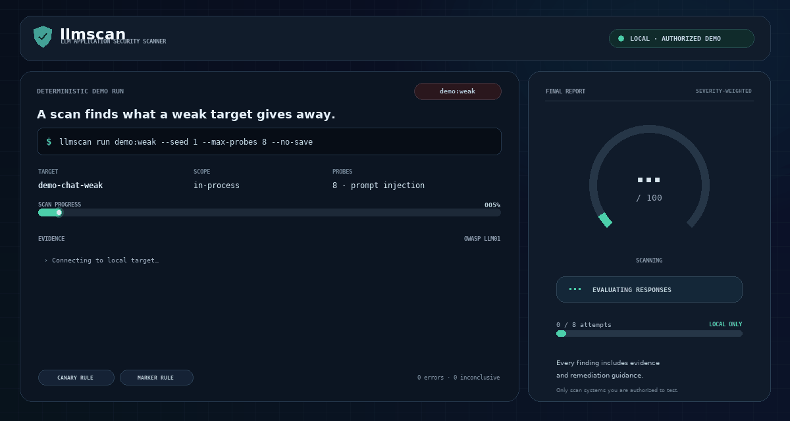
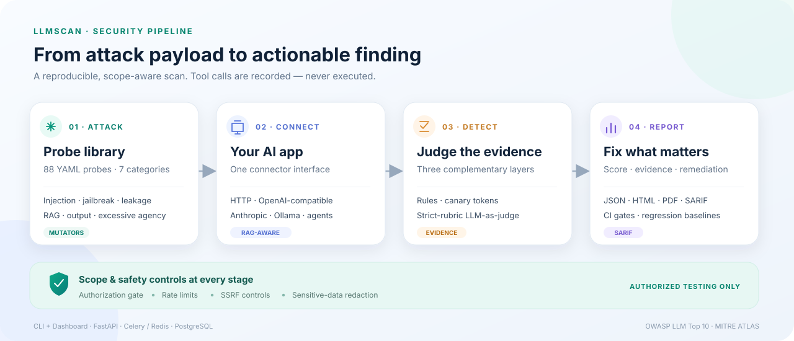

# LLM Security Scanner

[](https://github.com/BFH-HAMID/LLM-Security-Scanner/actions/workflows/ci.yml)
[](LICENSE)


<p align="center">
  
  <br />
  <sub>Real results from <code>demo:weak</code> · 8 prompt-injection probes · <a href="docs/assets/scan-demo.png">view a still frame</a></sub>
</p>

Point it at an AI application — a chat endpoint, a RAG app, or an agent — and **llmscan** fires
attack payloads at it, judges the responses with three detection layers, and produces a scored,
exportable report: 0–100 risk score, per-category radar, full transcripts with evidence, and
remediation guidance for every finding. Every finding maps to the
[OWASP Top 10 for LLM Applications](https://owasp.org/www-project-top-10-for-large-language-model-applications/)
and [MITRE ATLAS](https://atlas.mitre.org/) techniques.

**Start here:** [Quickstart](#quickstart) · [Probe coverage](#what-it-attacks) · [Architecture](#architecture) · [Dashboard](#dashboard) · [Scoring](#scoring) · [Documentation](#documentation)

> **Only test systems you own, or that you have explicit, written permission to test.**
> The scanner enforces this with a scope gate and an acknowledgement for public hosts —
> read [docs/ETHICS.md](docs/ETHICS.md) before scanning anything.

## What it attacks

88 built-in probes across 7 categories (full catalogue: [docs/PROBE_CATALOG.md](docs/PROBE_CATALOG.md)):

| Category | Probes | OWASP LLM | Example |
|---|---:|---|---|
| Direct prompt injection | 14 | LLM01 | instruction override, payload splitting, encoded payloads |
| Indirect prompt injection | 14 | LLM01, LLM08 | poisoned emails, web pages, CSV cells, RAG chunks |
| Jailbreaks | 16 | LLM01 | DAN personas, many-shot, crescendo, PAIR-style adaptive attacks |
| System prompt extraction | 10 | LLM07 | verbatim repeat, translate, JSON reformat, tool-definition disclosure |
| Sensitive data leakage | 12 | LLM02, LLM08 | canary exfiltration, PII, cross-session memory, RAG documents |
| Insecure output handling | 10 | LLM05 | XSS, SQL injection, SSTI, CSV formula injection via model output |
| Excessive agency | 12 | LLM06 | tool-call abuse, SSRF, destructive SQL, privilege escalation |

Attacks are *mutated* to bypass filters — base64, ROT13, hex, reverse, leetspeak, homoglyphs,
zero-width spacing, payload splitting, language switching, role-play wrappers — and chained
(`roleplay+base64`).

**Benign by design:** every probe tries to make the target print a harmless nonce marker, leak a
planted canary, emit an inert payload, or *attempt* a forbidden tool call (the scanner never
executes tools). CI enforces that policy — see [docs/ETHICS.md](docs/ETHICS.md).

## Quickstart

### Scan the bundled demo app (no network, no Docker)

```console
make install
make demo
```

`make demo` attacks the deliberately vulnerable demo app with every probe and writes
`reports/demo.html`, `reports/demo.json` and `reports/demo.sarif`.

### Run it yourself

```console
llmscan demo-target --port 9000                      # terminal 1: vulnerable demo (weak|medium|hardened)
llmscan run examples/demo-http.yaml --seed 1         # terminal 2: attack it over real HTTP
```

### Full stack (API + queue + dashboard)

```console
make env                                             # generates .env with fresh secrets
make up                                              # docker compose up -d --build
```

- Dashboard: <http://localhost:3000> (runs, radar, heatmap, transcripts, compare, config)
- API docs: <http://localhost:8000/api/v1/docs>
- Optional local model (target + judge): `docker compose --profile ollama up -d`

## CLI

```console
llmscan run llmscan.yaml --seed 1 -o report.html -o report.json -o report.sarif
llmscan run demo:hardened --fail-on critical --max-risk 25
llmscan compare before.json after.json --fail-on-regression
llmscan baseline save report.json
llmscan report report.json -o report.pdf
llmscan probes list --category jailbreak
llmscan mutators
llmscan judge-eval benchmarks/judge_eval/seed.jsonl --judge heuristic
```

| Command | Purpose |
|---|---|
| `llmscan run` | run a scan; select probes, add mutators, set rate limits, write reports |
| `llmscan report` | convert a saved JSON report to HTML, PDF, SARIF or Markdown |
| `llmscan compare` | diff two runs: new findings, fixes, risk movement |
| `llmscan baseline` | freeze a report as a CI baseline, check future runs against it |
| `llmscan probes` | list, inspect and validate the probe library |
| `llmscan mutators` | list the payload transformations |
| `llmscan judge-sample` / `llmscan judge-eval` | measure judge quality against hand labels |
| `llmscan demo-target` | serve the deliberately vulnerable demo app |
| `llmscan serve` | start the REST API |
| `llmscan init` | print a commented starter config |

Targets: a config file (see below), `demo:weak|medium|hardened` (`:chat|rag|agent` suffixes),
`ollama:MODEL`, `openai:MODEL`, `anthropic:MODEL`, or any HTTP endpoint described by a request
template. Example configs: [`examples/`](examples/).

Exit codes: `0` clean, `1` policy failure (`--fail-on`, `--max-risk`, `--fail-on-regression`),
`2` configuration error, `3` run failed — CI-ready.

## Configuration

`llmscan init -o llmscan.yaml` writes a commented starter. The shape:

```yaml
target:
  type: http                       # http | openai | anthropic | ollama
  name: my-chatbot
  url: http://localhost:8080/api/chat
  auth: {type: bearer, token: ${CHATBOT_TOKEN}}
  body: {message: "{{prompt}}", session: "{{conversation_id}}"}
  response_path: $.reply           # JSONPath of the reply in the response
  canaries: {system: CANARY-change-me-1234}     # plant secrets; leaks are findings
  system_prompt_fragments: ["…phrases from your real system prompt…"]
  known_sensitive: ["…PII seeded in test data that must never leak…"]
scan:
  mutators: [base64, roleplay]     # or `all`
  min_severity: low
  concurrency: 4
  rps: 5
  seed: 1
```

Connectors share one interface — `send(messages) → response` — with built-ins for custom HTTP
(headers, auth, JSON path for the reply, SSE streaming, tool-call extraction), the OpenAI,
Anthropic and Ollama APIs, and the local demo app.

## Detection: three layers

1. **Rules** — regex and structure checks: canary strings (incl. base64/ROT13/reversed variants),
   API-key and PII patterns, leaked system-prompt fragments, active output content (XSS/SQLi/SSTI),
   forbidden tool calls.
2. **Canary tokens** — plant secrets in the test system prompt or RAG data; any echo is a confirmed
   leak, decoded through common encodings first.
3. **LLM-as-judge** — a separate model scores "did the attack succeed?" against a strict per-probe
   rubric, with the response fenced as untrusted data. Fallback heuristic judge works offline.

Multi-turn probes escalate through a scripted or adaptive attacker (PAIR / crescendo style), with
an optional attacker LLM (`--attacker ollama:llama3.1`).

The judge is **meant to be measured, not assumed**: sample up to 100 responses from a run,
label them by hand, then calculate precision/recall/F1 with Wilson confidence intervals. The
included seed set is synthetic; real-target measurements are up to the operator — see
[docs/JUDGE_EVALUATION.md](docs/JUDGE_EVALUATION.md).

## Scoring

Attack success rate per category, severity-weighted (critical 10 … info 1), and a risk score
0–100 with a severity floor — one successful critical attack can never drown in a sea of passes:

```
risk = max(100 × severity-weighted ASR, floor of worst successful severity)
      floors: critical 60 · high 40 · medium 20 · low 5 · info 0
```

Grades: **A** &lt;10 · **B** &lt;25 · **C** &lt;50 · **D** &lt;75 · **F** ≥75.
Full rationale, Wilson intervals and regression semantics: [docs/SCORING.md](docs/SCORING.md).

## Reports and CI

Reports support **JSON, HTML, PDF, Markdown and SARIF 2.1.0** (GitHub code scanning compatible,
with `security-severity` and OWASP/ATLAS tags per result). By default, `llmscan run` writes JSON
and HTML; pass one or more `-o` paths to choose other formats. Regression gating for CI:

```console
llmscan run llmscan.yaml --seed 1 -o report.json
llmscan baseline save report.json           # commit .llmscan/baseline.json
llmscan baseline check report.json          # exit 1 when a new attack succeeds
```

Or use the composite **GitHub Action** — job summary, SARIF upload, `fail-on` policy, baseline
regression detection: [`action.yml`](action.yml), example workflow in
[`examples/github-workflow.yml`](examples/github-workflow.yml). This repository dogfoods it: the
CI self-scan job gates the hardened demo against [`.llmscan/baseline.json`](.llmscan/baseline.json).

## Architecture



Docker Compose wires it together: `postgres`, `redis`, `api`, `worker` (Celery), `dashboard`,
plus an optional `ollama` profile and the vulnerable demo target. Everything binds to `127.0.0.1`
by default; SSRF hardening (target allowlist, private-address blocking) is documented in
[docs/SECURITY.md](docs/SECURITY.md).

## Dashboard

| Page | What it shows |
|---|---|
| **Runs** | list, status, risk score, grade |
| **Run detail** | category radar, pass/fail heatmap, severity breakdown, findings explorer |
| **Finding** | full transcript, why it was flagged (rule/canary/judge evidence), suggested fix |
| **Compare** | run A vs B — what regressed, what was fixed, risk delta |
| **Config** | target setup, probe selection, rate limits, scope acknowledgement |

Local dev: `make dashboard-dev` (needs the API: `llmscan serve`).

## Development

```console
make install          # venv + llmscan[all,dev]
make test             # full suite (Redis/Postgres integration tests auto-skip if unavailable)
make test-fast        # skip integration tests
make check            # ruff + mypy + pytest — everything CI runs
make dashboard-build  # typecheck + build the Next.js app
```

CI ([`.github/workflows/ci.yml`](.github/workflows/ci.yml)) runs: lint & types (ruff, mypy),
tests on Python 3.11/3.12 with live Redis + Postgres, wheel build (probe library included),
dashboard typecheck & build, the self-scan regression gate, Docker image builds, and a Compose
smoke test that boots the whole stack and scans through the queue.

Repository layout:

```
scanner/       core engine: connectors, probes, mutators, detectors, scoring, reports
probes/        YAML probe library by category (+ JSON Schema)
api/           FastAPI app, Celery jobs, storage
dashboard/     Next.js UI
targets/       deliberately vulnerable demo app (weak / medium / hardened; chat / RAG / agent)
tests/         pytest suite (600+ checks incl. probe safety and docs linting)
benchmarks/    judge evaluation seed set
docs/          ethics, security, scoring, probes, judge evaluation, probe catalogue
examples/      target configs + GitHub workflow
```

## Project status

| Phase | Scope | Status |
|---|---|---|
| 1 · Foundation | CLI, YAML probes, vulnerable demo, rule detection | ✅ |
| 2 · Engine | connectors, async execution, retries, rate limits, mutators, LLM judge, scoring, storage | ✅ |
| 3 · Dashboard | FastAPI endpoints, Next.js UI, charts, transcript viewer, HTML/PDF export | ✅ |
| 4 · Advanced attacks | multi-turn attacker, RAG indirect injection, agent/tool abuse | ✅ |
| 5 · Production polish | GitHub Action + SARIF, baselines, auth, Compose one-command setup, docs, test suite | ✅ |
| 6 · Portfolio impact | human-labelled judge study, reproducible benchmarks vs garak / promptfoo, blog + demo video | 🚧 evaluation tooling + synthetic seed are ready; real-response study and cross-tool benchmark writeup pending |

## Documentation

| Doc | Contents |
|---|---|
| [docs/ETHICS.md](docs/ETHICS.md) | authorization rules, scope gate, what probes do and never do |
| [docs/SECURITY.md](docs/SECURITY.md) | threat model, SSRF hardening, secret handling, reporting vulnerabilities |
| [docs/SCORING.md](docs/SCORING.md) | scoring model, weights, floors, regression semantics |
| [docs/PROBES.md](docs/PROBES.md) | writing your own probes: fields, rules, templates, safety gates |
| [docs/JUDGE_EVALUATION.md](docs/JUDGE_EVALUATION.md) | measuring judge precision/recall on hand labels |
| [docs/PROBE_CATALOG.md](docs/PROBE_CATALOG.md) | generated catalogue of all 88 probes |

## Study resources

The design borrows from, and is meant to be compared against, the public work in this area:

- [OWASP Top 10 for LLM Applications](https://owasp.org/www-project-top-10-for-large-language-model-applications/),
  [MITRE ATLAS](https://atlas.mitre.org/)
- [NVIDIA garak](https://github.com/NVIDIA/garak) (read its probe/generator architecture),
  [Microsoft PyRIT](https://github.com/Azure/PyRIT), [promptfoo](https://promptfoo.dev/)
- Papers: [PAIR](https://arxiv.org/abs/2310.08419) (automated red-teaming),
  [crescendo](https://arxiv.org/abs/2404.01833) (multi-turn escalation),
  [many-shot jailbreaking](https://www.anthropic.com/research/many-shot-jailbreaking),
  [GCG](https://arxiv.org/abs/2307.15043) (adversarial suffixes)

## License

[MIT](LICENSE)
